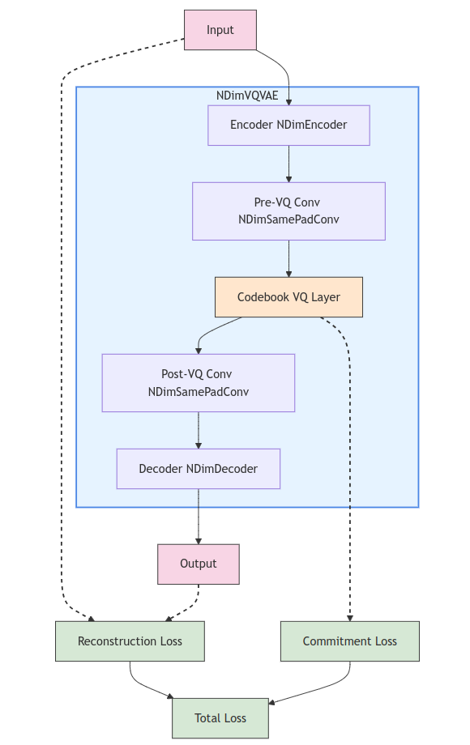

# nd_vq_vae

[](https://codecov.io/gh/AdityaNG/nD_VQ_VAE)
[](https://github.com/AdityaNG/nD_VQ_VAE/actions/workflows/main.yml)

PyTorch Implementation of the N-Dimensional VQ-VAE by AdityaNG




## Install it from PyPI

```bash
pip install nd_vq_vae
```

## Cite

Cite our work if you find it useful!

```bibtex
@article{NG2024D3Nav,
  title={D³Nav: Data-Driven Driving Agents for Autonomous Vehicles in Unstructured Traffic},
  author={Aditya NG and Gowri Srinivas},
  journal={The 35th British Machine Vision Conference (BMVC)},
  year={2024},
  url={https://bmvc2024.org/}
}
``` 

## Usage

Below is an example of encoding temporal video data. Video data is 3D since it spans height and width as well as time. Note that the channels are each treated separately and does not count as a dimension.
```py
from nd_vq_vae import NDimVQVAE

sequence_length = 3
channels = 3
res = (128, 256)
input_shape = (channels, sequence_length, res[0], res[1])

model = NDimVQVAE(
    embedding_dim=64,
    n_codes=64,
    n_dims=3,
    downsample=args.downsample,
    n_hiddens=64,
    n_res_layers=2,
    codebook_beta=0.10,
    input_shape=input_shape,
)

x = torch.randn(batch_size, *input_shape)
recon_loss, x_recon, vq_output = model(x)
```

### 3D: Train on Videos

Videos are 3 dimensional data with (Time, Height, Width).
You can construct a video dataset at `data/video_dataset/` as follows:
```bash
$ tree data/video_dataset/
data/video_dataset/
├── test
│   ├── Gu1D3BnIYZg.mkv  # you can add more videos to both folders
└── train
    └── ceEE_oYuzS4.mp4
```

### 2D: Train on Images

Videos are 2 dimensional data with (Height, Width).
You can construct a video dataset at `data/image_dataset/` as follows:
```bash
$ tree data/image_dataset/
data/image_dataset/
├── test
│   ├── 0000001.png  # you can add more images to both folders
└── train
    └── 0000001.png
```

Then you can use the video training script:

```bash
python scripts/train_image.py --data_path data/image_dataset/
```

### 1D

Coming soon!

### Hyperparameters: How to tune my VQ-VAE?

The VQ-VAE has the following hyperparameters
1. Codebook size and embedding dimension (n_codes and embedding_dim)
2. Model capacity (n_hiddens and n_res_layers)
3. Downsampling strategy (downsample)
4. Loss balancing (codebook_beta and recon_loss_factor)
5. Optimization parameters (learning_rate, beta1, beta2)
6. Training parameters (batch_size, num_epochs)
7. Attention mechanism (n_head, attn_dropout)
8. Codebook update strategy (ema_decay)

Below is how you would tune these parameters based on the `recon_loss` and `commitment_loss` curves.
1. Monitor Key Metrics
- Track these metrics during training and validation:
    - Reconstruction Loss
    - Commitment Loss
    - Perplexity
2. Analyze Loss Curves
- Reconstruction Loss
    - High and not decreasing: Increase model capacity (n_hiddens, n_res_layers) or adjust learning rate.
    - Train decreasing, val stable: Potential overfitting. Reduce capacity or add regularization.
    - Both decreasing, val much higher: Increase batch_size or use data augmentation.
- Commitment Loss
    - Too high: Decrease codebook_beta.
    - Too low or unstable: Increase codebook_beta.
3. Balance Losses
- Adjust codebook_beta and recon_loss_factor to achieve a good balance between reconstruction and commitment losses.
4. Optimize Codebook Usage
- Monitor perplexity:
    - Low perplexity: Increase n_codes or decrease embedding_dim.
    - High perplexity: Decrease n_codes or increase embedding_dim.
5. Fine-tune Learning Dynamics
- Slow convergence: Increase learning_rate or adjust optimizer parameters.
- Unstable training: Decrease learning_rate or increase batch_size.
6. Address Overfitting
- If validation loss plateaus while training loss decreases:
    - Introduce dropout in encoder/decoder
    - Reduce model capacity
    - Increase batch_size or use data augmentation
7. Attention Mechanism
- Adjust n_head and attn_dropout in attention blocks for better long-range dependencies.
8. Codebook Update Strategy
- Fine-tune ema_decay for codebook stability and adaptation speed.
9. Downsampling Strategy
- Adjust downsample factors based on computational resources and required detail level.

Best Practices
- Make incremental changes to hyperparameters.
- Perform ablation studies, changing one parameter at a time.
- Consider using learning rate scheduling or cyclical learning rates.
- Regularly save checkpoints and log experiments for comparison.

## Development

Read the [CONTRIBUTING.md](CONTRIBUTING.md) file.
