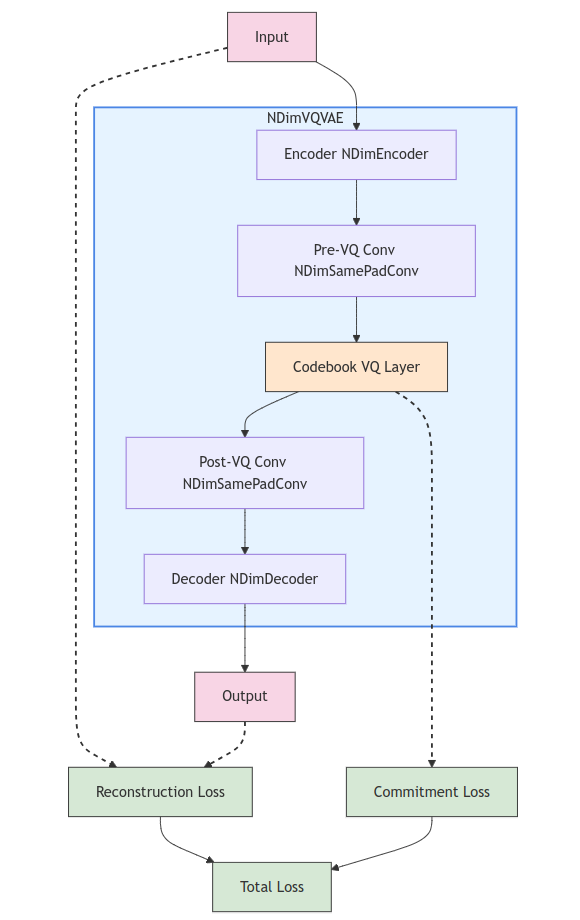

# nd_vq_vae

[](https://codecov.io/gh/AdityaNG/nD_VQ_VAE)
[](https://github.com/AdityaNG/nD_VQ_VAE/actions/workflows/main.yml)

PyTorch Implementation of the N-Dimensional VQ-VAE by AdityaNG




## Install it from PyPI

```bash
pip install nd_vq_vae
```

## Cite

Cite our work if you find it useful!

```bibtex
@article{NG2024D3Nav,
  title={D³Nav: Data-Driven Driving Agents for Autonomous Vehicles in Unstructured Traffic},
  author={Aditya NG and Gowri Srinivas},
  journal={The 35th British Machine Vision Conference (BMVC)},
  year={2024},
  url={https://bmvc2024.org/}
}
``` 

## Development

Read the [CONTRIBUTING.md](CONTRIBUTING.md) file.
